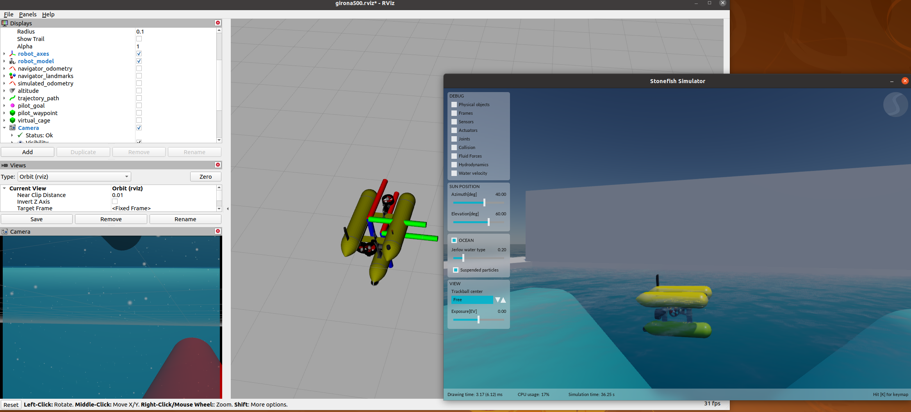
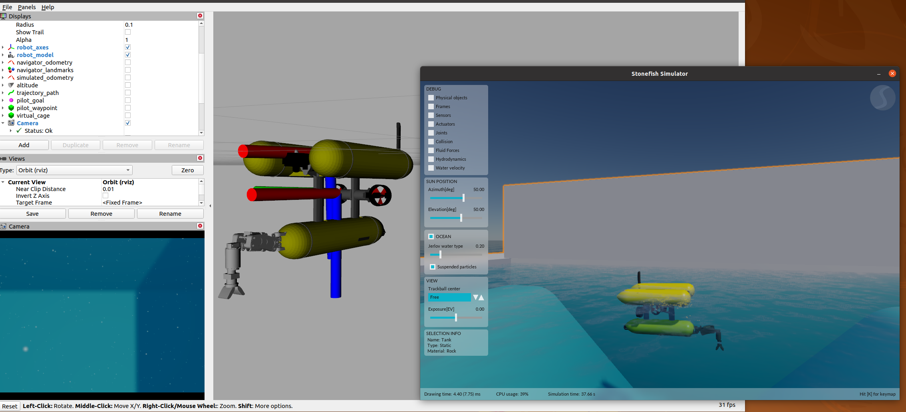
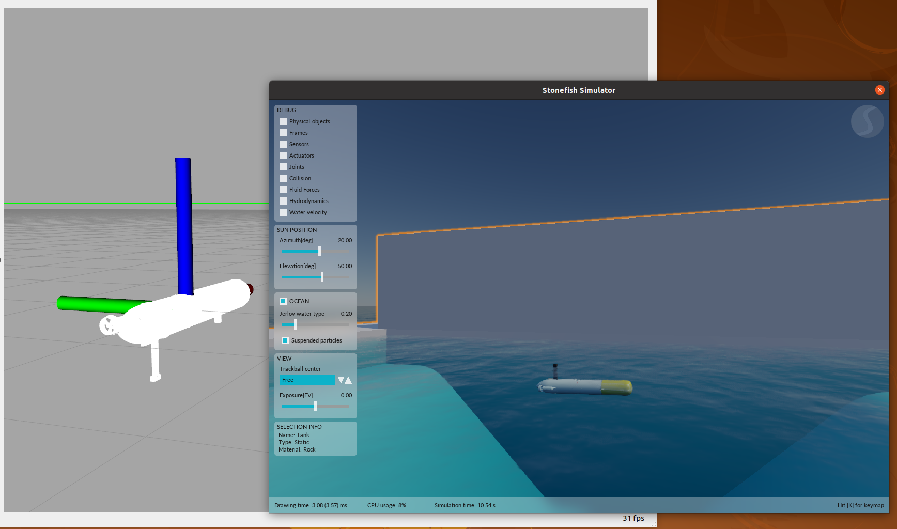

# stonefish_deployment

> This is the unofficial deployment of the Stonefish underwater simulator.

Reference:

- https://github.com/patrykcieslak/stonefish_ros
- https://github.com/patrykcieslak/stonefish
- Paper: Stonefish: An advanced open-source simulation tool designed for marine robotics, with a ROS interface, 2019
- https://stonefish.readthedocs.io/en
- https://github.com/Rogerpi/stonefish_ros (other people deployment repo)

## Deployment

### 1.Dependencies

```BASH
# My Environment: Ubuntu 20.04 
# Reference: https://stonefish-ros.readthedocs.io/en/latest/install.html
# 1.OpenGL Mathematics library, libglm-dev version >= 0.9.9.0
sudo apt install libglm-dev
# 2.SDL2 library, ibsdl2-dev
sudo apt install libglm-dev
# 3.Freetype library, libfreetype6-dev
sudo apt install libfreetype6-dev
# 4.OPENGL CHECK, VERSION >= 4.3
glxinfo | grep "OpenGL version"

# 5.others
sudo apt-get install lcov 
sudo apt-get install ros-noetic-joy
sudo apt-get install ros-noetic-rosbridge-server

# 6.compile stonefish
git clone https://github.com/patrykcieslak/stonefish
cd stonefish && mkdir build  && cd build  && cmake ..  && make && sudo make install

# 7.compile cola2_lib
git clone https://bitbucket.org/iquarobotics/cola2_lib/ 
cd cola2_lib && mkdir build  && cd build  && cmake ..  && make && sudo make install
```

### 2.ROS catkin_make

#### Option 1 (Recommended)

```bash
# Under the "/src" directory in the ROS workspace.
git clone https://github.com/DoongLi/stonefish_deployment
catkin_make
```

#### Option 2

```bash
# Under the "/src" directory in the ROS workspace.
git clone https://bitbucket.org/iquarobotics/cola2_msgs
git clone https://bitbucket.org/udg_cirs/cola2_stonefish
git clone https://bitbucket.org/udg_cirs/cola2_stonefish
git clone https://bitbucket.org/iquarobotics/sparus2_description/
git clone https://bitbucket.org/iquarobotics/cola2_girona500
git clone https://bitbucket.org/iquarobotics/girona500_description
git clone https://bitbucket.org/iquarobotics/cola2_core/
git clone https://bitbucket.org/iquarobotics/cola2_msgs/
git clone https://bitbucket.org/iquarobotics/cola2_sparus2
git clone https://bitbucket.org/udg_cirs/eca_5emicro_manipulator_description/
git clone https://bitbucket.org/iquarobotics/cola2_lib_ros/ 

# refere https://github.com/Rogerpi/stonefish_ros/blob/master/launch/simulator.launch to modify simulator.launch

catkin_make
```

### 4.RUN DEMO

```BASH
# Reference: https://stonefish-ros.readthedocs.io/en/latest/running.html  & https://bitbucket.org/udg_cirs/cola2_stonefish
roslaunch cola2_stonefish girona500_tank_simulation.launch 
roslaunch cola2_stonefish girona500_valve_turning_simulation.launch
roslaunch cola2_stonefish sparus2_tank_simulation.launch 
```





