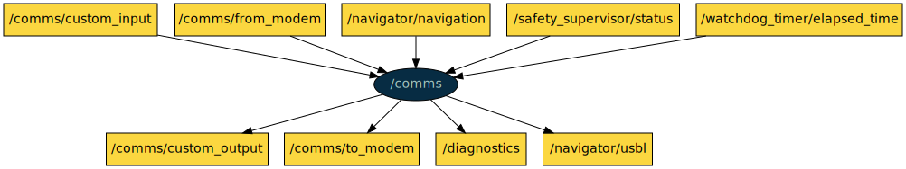

# COLA2 COMMS

This is a ROS package with nodes to perform acoustic communication.

[TOC]

[//]: <> (comms start)

## comms

**Node**: /comms

This node handles the data interchanged in acoustic communications, establishing a protocol to communicate between COLA2 and the modem device.

**Publishers**:

* /comms/custom_output [[std_msgs/String](http://docs.ros.org/noetic/api/std_msgs/html/msg/String.html)]
* /comms/to_modem [[std_msgs/String](http://docs.ros.org/noetic/api/std_msgs/html/msg/String.html)]
* /diagnostics [[diagnostic_msgs/DiagnosticArray](http://docs.ros.org/noetic/api/diagnostic_msgs/html/msg/DiagnosticArray.html)]
* /navigator/usbl [[geometry_msgs/PoseWithCovarianceStamped](http://docs.ros.org/noetic/api/geometry_msgs/html/msg/PoseWithCovarianceStamped.html)]

**Subscribers**:

* /comms/custom_input [[std_msgs/String](http://docs.ros.org/noetic/api/std_msgs/html/msg/String.html)]
* /comms/from_modem [[std_msgs/String](http://docs.ros.org/noetic/api/std_msgs/html/msg/String.html)]
* /navigator/navigation [[cola2_msgs/NavSts](http://api.iquarobotics.com/202401/api/cola2_msgs/html/msg/NavSts.html)]
* /safety_supervisor/status [[cola2_msgs/SafetySupervisorStatus](http://api.iquarobotics.com/202401/api/cola2_msgs/html/msg/SafetySupervisorStatus.html)]
* /watchdog_timer/elapsed_time [[std_msgs/Int32](http://docs.ros.org/noetic/api/std_msgs/html/msg/Int32.html)]

**Services**:

* /comms/reload_params [[std_srvs/Trigger](http://docs.ros.org/noetic/api/std_srvs/html/srv/Trigger.html)]
* /comms/reset_recovery_action [[std_srvs/Trigger](http://docs.ros.org/noetic/api/std_srvs/html/srv/Trigger.html)]

**Parameters**:

* /comms/custom_max_time
* /comms/identifier
* /comms/max_message_size
* /comms/send_to_modem_period
* /comms/usbl_safe_always_on

[//]: <> (comms end)
