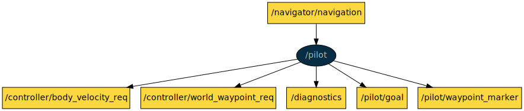

# COLA2 CONTROL

This is a ROS package with nodes to control the COLA2-based AUVs.

[TOC]

[//]: <> (captain start)

## captain

**Node**: /captain

This node provides automatic control actions including: goto a waypoint, keep position (standard or triggered by safety reasons), conduct a section between two points, execute a mission or execute an external mission commanded from another node. This node mainly translates user requests coming from services into pilot action_libs.

**Publishers**:

* /captain/captain_status [[cola2_msgs/CaptainStatus](http://api.iquarobotics.com/202401/api/cola2_msgs/html/msg/CaptainStatus.html)]
* /captain/mission [[std_msgs/String](http://docs.ros.org/noetic/api/std_msgs/html/msg/String.html)]
* /captain/state_feedback [[cola2_msgs/CaptainStateFeedback](http://api.iquarobotics.com/202401/api/cola2_msgs/html/msg/CaptainStateFeedback.html)]
* /captain/trajectory_path [[nav_msgs/Path](http://docs.ros.org/noetic/api/nav_msgs/html/msg/Path.html)]
* /diagnostics [[diagnostic_msgs/DiagnosticArray](http://docs.ros.org/noetic/api/diagnostic_msgs/html/msg/DiagnosticArray.html)]
* /input_to_teleoperation/output [[sensor_msgs/Joy](http://docs.ros.org/noetic/api/sensor_msgs/html/msg/Joy.html)]

**Subscribers**:

* /navigator/navigation [[cola2_msgs/NavSts](http://api.iquarobotics.com/202401/api/cola2_msgs/html/msg/NavSts.html)]

**Services**:

* /captain/disable_all_and_set_idle [[std_srvs/Trigger](http://docs.ros.org/noetic/api/std_srvs/html/srv/Trigger.html)]
* /captain/disable_all_keep_positions [[std_srvs/Trigger](http://docs.ros.org/noetic/api/std_srvs/html/srv/Trigger.html)]
* /captain/disable_external_mission [[std_srvs/Trigger](http://docs.ros.org/noetic/api/std_srvs/html/srv/Trigger.html)]
* /captain/disable_goto [[std_srvs/Trigger](http://docs.ros.org/noetic/api/std_srvs/html/srv/Trigger.html)]
* /captain/disable_keep_position [[std_srvs/Trigger](http://docs.ros.org/noetic/api/std_srvs/html/srv/Trigger.html)]
* /captain/disable_mission [[cola2_msgs/Mission](http://api.iquarobotics.com/202401/api/cola2_msgs/html/srv/Mission.html)]
* /captain/disable_safety_keep_position [[std_srvs/Trigger](http://docs.ros.org/noetic/api/std_srvs/html/srv/Trigger.html)]
* /captain/disable_section [[std_srvs/Trigger](http://docs.ros.org/noetic/api/std_srvs/html/srv/Trigger.html)]
* /captain/enable_external_mission [[std_srvs/Trigger](http://docs.ros.org/noetic/api/std_srvs/html/srv/Trigger.html)]
* /captain/enable_goto [[cola2_msgs/Goto](http://api.iquarobotics.com/202401/api/cola2_msgs/html/srv/Goto.html)]
* /captain/enable_keep_position_holonomic [[std_srvs/Trigger](http://docs.ros.org/noetic/api/std_srvs/html/srv/Trigger.html)]
* /captain/enable_keep_position_non_holonomic [[std_srvs/Trigger](http://docs.ros.org/noetic/api/std_srvs/html/srv/Trigger.html)]
* /captain/enable_mission [[cola2_msgs/Mission](http://api.iquarobotics.com/202401/api/cola2_msgs/html/srv/Mission.html)]
* /captain/enable_safety_keep_position [[std_srvs/Trigger](http://docs.ros.org/noetic/api/std_srvs/html/srv/Trigger.html)]
* /captain/enable_section [[cola2_msgs/Section](http://api.iquarobotics.com/202401/api/cola2_msgs/html/srv/Section.html)]
* /captain/pause_mission [[std_srvs/Trigger](http://docs.ros.org/noetic/api/std_srvs/html/srv/Trigger.html)]
* /captain/reload_params [[std_srvs/Trigger](http://docs.ros.org/noetic/api/std_srvs/html/srv/Trigger.html)]
* /captain/reset_keep_position [[std_srvs/Trigger](http://docs.ros.org/noetic/api/std_srvs/html/srv/Trigger.html)]
* /captain/resume_mission [[cola2_msgs/Mission](http://api.iquarobotics.com/202401/api/cola2_msgs/html/srv/Mission.html)]

**Parameters**:

* /captain/disable_no_altitude_goes_up_service
* /captain/enable_no_altitude_goes_up_service
* /captain/idle_no_altitude_goes_up
* /captain/max_distance_to_waypoint
* /captain/reset_keep_position_on_navigation_jump
* /captain/safety_keep_position_depth
* /captain/safety_keep_position_goes_to_ned_origin
* /captain/vehicle_config_launch_mission_package

[//]: <> (captain end)

[//]: <> (controller start)

## controller

**Node**: /controller

This node implements the pose and velocity low level controllers and the thruster allocator.

**Publishers**:

* /controller/merged_body_force_req [[cola2_msgs/BodyForceReq](http://api.iquarobotics.com/202401/api/cola2_msgs/html/msg/BodyForceReq.html)]
* /controller/merged_body_velocity_req [[cola2_msgs/BodyVelocityReq](http://api.iquarobotics.com/202401/api/cola2_msgs/html/msg/BodyVelocityReq.html)]
* /controller/merged_world_waypoint_req [[cola2_msgs/WorldWaypointReq](http://api.iquarobotics.com/202401/api/cola2_msgs/html/msg/WorldWaypointReq.html)]
* /controller/thruster_setpoints [[cola2_msgs/Setpoints](http://api.iquarobotics.com/202401/api/cola2_msgs/html/msg/Setpoints.html)]
* /diagnostics [[diagnostic_msgs/DiagnosticArray](http://docs.ros.org/noetic/api/diagnostic_msgs/html/msg/DiagnosticArray.html)]

**Subscribers**:

* /controller/body_force_req [[cola2_msgs/BodyForceReq](http://api.iquarobotics.com/202401/api/cola2_msgs/html/msg/BodyForceReq.html)]
* /controller/body_velocity_req [[cola2_msgs/BodyVelocityReq](http://api.iquarobotics.com/202401/api/cola2_msgs/html/msg/BodyVelocityReq.html)]
* /controller/world_waypoint_req [[cola2_msgs/WorldWaypointReq](http://api.iquarobotics.com/202401/api/cola2_msgs/html/msg/WorldWaypointReq.html)]
* /navigator/navigation [[cola2_msgs/NavSts](http://api.iquarobotics.com/202401/api/cola2_msgs/html/msg/NavSts.html)]

**Services**:

* /controller/disable_pose_controller [[std_srvs/Trigger](http://docs.ros.org/noetic/api/std_srvs/html/srv/Trigger.html)]
* /controller/disable_thrusters [[std_srvs/Trigger](http://docs.ros.org/noetic/api/std_srvs/html/srv/Trigger.html)]
* /controller/disable_velocity_controller [[std_srvs/Trigger](http://docs.ros.org/noetic/api/std_srvs/html/srv/Trigger.html)]
* /controller/enable_pose_controller [[std_srvs/Trigger](http://docs.ros.org/noetic/api/std_srvs/html/srv/Trigger.html)]
* /controller/enable_thrusters [[std_srvs/Trigger](http://docs.ros.org/noetic/api/std_srvs/html/srv/Trigger.html)]
* /controller/enable_velocity_controller [[std_srvs/Trigger](http://docs.ros.org/noetic/api/std_srvs/html/srv/Trigger.html)]

**Parameters**:

* /controller/TCM
* /controller/enable_thrusters
* /controller/max_force_thruster_negative
* /controller/max_force_thruster_positive
* /controller/max_velocity_pitch
* /controller/max_velocity_roll
* /controller/max_velocity_x
* /controller/max_velocity_y
* /controller/max_velocity_yaw
* /controller/max_velocity_z
* /controller/max_wrench_Pitch
* /controller/max_wrench_Roll
* /controller/max_wrench_X
* /controller/max_wrench_Y
* /controller/max_wrench_Yaw
* /controller/max_wrench_Z
* /controller/n_thrusters
* /controller/p_heave_fff
* /controller/p_heave_i_limit
* /controller/p_heave_kp
* /controller/p_heave_td
* /controller/p_heave_ti
* /controller/p_pitch_fff
* /controller/p_pitch_i_limit
* /controller/p_pitch_kp
* /controller/p_pitch_td
* /controller/p_pitch_ti
* /controller/p_roll_fff
* /controller/p_roll_i_limit
* /controller/p_roll_kp
* /controller/p_roll_td
* /controller/p_roll_ti
* /controller/p_surge_fff
* /controller/p_surge_i_limit
* /controller/p_surge_kp
* /controller/p_surge_td
* /controller/p_surge_ti
* /controller/p_sway_fff
* /controller/p_sway_i_limit
* /controller/p_sway_kp
* /controller/p_sway_td
* /controller/p_sway_ti
* /controller/p_yaw_fff
* /controller/p_yaw_i_limit
* /controller/p_yaw_kp
* /controller/p_yaw_td
* /controller/p_yaw_ti
* /controller/period
* /controller/poly_heave_A
* /controller/poly_heave_B
* /controller/poly_heave_C
* /controller/poly_pitch_A
* /controller/poly_pitch_B
* /controller/poly_pitch_C
* /controller/poly_roll_A
* /controller/poly_roll_B
* /controller/poly_roll_C
* /controller/poly_surge_A
* /controller/poly_surge_B
* /controller/poly_surge_C
* /controller/poly_sway_A
* /controller/poly_sway_B
* /controller/poly_sway_C
* /controller/poly_yaw_A
* /controller/poly_yaw_B
* /controller/poly_yaw_C
* /controller/set_zero_velocity_axes
* /controller/set_zero_velocity_depth
* /controller/t_heave_fff
* /controller/t_heave_i_limit
* /controller/t_heave_kp
* /controller/t_heave_td
* /controller/t_heave_ti
* /controller/t_pitch_fff
* /controller/t_pitch_i_limit
* /controller/t_pitch_kp
* /controller/t_pitch_td
* /controller/t_pitch_ti
* /controller/t_roll_fff
* /controller/t_roll_i_limit
* /controller/t_roll_kp
* /controller/t_roll_td
* /controller/t_roll_ti
* /controller/t_surge_fff
* /controller/t_surge_i_limit
* /controller/t_surge_kp
* /controller/t_surge_td
* /controller/t_surge_ti
* /controller/t_sway_fff
* /controller/t_sway_i_limit
* /controller/t_sway_kp
* /controller/t_sway_td
* /controller/t_sway_ti
* /controller/t_yaw_fff
* /controller/t_yaw_i_limit
* /controller/t_yaw_kp
* /controller/t_yaw_td
* /controller/t_yaw_ti
* /controller/thruster_1_max_force_negative
* /controller/thruster_1_max_force_positive
* /controller/thruster_1_poly_negative
* /controller/thruster_1_poly_positive
* /controller/thruster_2_max_force_negative
* /controller/thruster_2_max_force_positive
* /controller/thruster_2_poly_negative
* /controller/thruster_2_poly_positive
* /controller/thruster_3_max_force_negative
* /controller/thruster_3_max_force_positive
* /controller/thruster_3_poly_negative
* /controller/thruster_3_poly_positive
* /controller/thruster_4_max_force_negative
* /controller/thruster_4_max_force_positive
* /controller/thruster_4_poly_negative
* /controller/thruster_4_poly_positive
* /controller/thruster_5_max_force_negative
* /controller/thruster_5_max_force_positive
* /controller/thruster_5_poly_negative
* /controller/thruster_5_poly_positive
* /controller/thruster_distance_yaw

[//]: <> (controller end)

[//]: <> (keyboard start)

## keyboard

**Node**: /keyboard

This node is used to drive the AUV from a unix terminal using keyboard commands. It takes keystrokes and converts them to sensor_msgs/Joy.

**Publishers**:

* /joy [[sensor_msgs/Joy](http://docs.ros.org/noetic/api/sensor_msgs/html/msg/Joy.html)]

**Subscribers**: None

**Services**: None

**Parameters**: None

[//]: <> (keyboard end)

[//]: <> (keyboard_to_teleoperation start)

## keyboard_to_teleoperation

**Node**: /keyboard_to_teleoperation

This node converts sensor_msgs/Joy messages that come from the keyboard driver and transforms them to a common sensor_msgs/Joy format that can be understood by the teleoperation node. This node also allows to enable/disable thrusters.

**Publishers**:

* /input_to_teleoperation/ack [[std_msgs/String](http://docs.ros.org/noetic/api/std_msgs/html/msg/String.html)]
* /input_to_teleoperation/output [[sensor_msgs/Joy](http://docs.ros.org/noetic/api/sensor_msgs/html/msg/Joy.html)]

**Subscribers**:

* /joy [[sensor_msgs/Joy](http://docs.ros.org/noetic/api/sensor_msgs/html/msg/Joy.html)]
* /teleoperation/ack [[std_msgs/String](http://docs.ros.org/noetic/api/std_msgs/html/msg/String.html)]

**Services**: None

**Parameters**: None

[//]: <> (keyboard_to_teleoperation end)

[//]: <> (logitech_fx10_to_teleoperation start)

## logitech_fx10_to_teleoperation

**Node**: /logitech_fx10_to_teleoperation

This node converts sensor_msgs/Joy messages that come from the LogitechFX10 driver and transforms them to a common sensor_msgs/Joy format that can be understood by the teleoperation node. This node also allows to enable/disable thrusters and enable/disable keep position.

**Publishers**:

* /input_to_teleoperation/ack [[std_msgs/String](http://docs.ros.org/noetic/api/std_msgs/html/msg/String.html)]
* /input_to_teleoperation/output [[sensor_msgs/Joy](http://docs.ros.org/noetic/api/sensor_msgs/html/msg/Joy.html)]

**Subscribers**:

* /joy [[sensor_msgs/Joy](http://docs.ros.org/noetic/api/sensor_msgs/html/msg/Joy.html)]
* /teleoperation/ack [[std_msgs/String](http://docs.ros.org/noetic/api/std_msgs/html/msg/String.html)]

**Services**: None

**Parameters**:

* /logitech_fx10_to_teleoperation/start_service
* /logitech_fx10_to_teleoperation/stop_service

[//]: <> (logitech_fx10_to_teleoperation end)

[//]: <> (pilot start)

## pilot

**Node**: /pilot

This node implements different controllers that can be used by the captain node, by means of an action lib. Upon request, it publishes position and velocity setpoints to the position and velocity controllers of the vehicle.

**Publishers**:

* /controller/body_velocity_req [[cola2_msgs/BodyVelocityReq](http://api.iquarobotics.com/202401/api/cola2_msgs/html/msg/BodyVelocityReq.html)]
* /controller/world_waypoint_req [[cola2_msgs/WorldWaypointReq](http://api.iquarobotics.com/202401/api/cola2_msgs/html/msg/WorldWaypointReq.html)]
* /diagnostics [[diagnostic_msgs/DiagnosticArray](http://docs.ros.org/noetic/api/diagnostic_msgs/html/msg/DiagnosticArray.html)]
* /pilot/goal [[geometry_msgs/PointStamped](http://docs.ros.org/noetic/api/geometry_msgs/html/msg/PointStamped.html)]
* /pilot/waypoint_marker [[visualization_msgs/Marker](http://docs.ros.org/noetic/api/visualization_msgs/html/msg/Marker.html)]

**Subscribers**:

* /navigator/navigation [[cola2_msgs/NavSts](http://api.iquarobotics.com/202401/api/cola2_msgs/html/msg/NavSts.html)]

**Services**:

* /pilot/reload_params [[std_srvs/Trigger](http://docs.ros.org/noetic/api/std_srvs/html/srv/Trigger.html)]

**Parameters**:

* /pilot/anchor/kp
* /pilot/anchor/max_surge_velocity
* /pilot/anchor/min_surge_velocity
* /pilot/anchor/radius
* /pilot/section/delta
* /pilot/section/distance_to_max_velocity
* /pilot/section/max_surge_velocity
* /pilot/section/min_surge_velocity
* /pilot/section/tolerance_z

[//]: <> (pilot end)

[//]: <> (teleoperation start)

## teleoperation

**Node**: /teleoperation

This node takes the data coming from a joystick/keyboard device and generates a World Waypoint Request or a Body Velocity Request.

**Publishers**:

* /controller/body_velocity_req [[cola2_msgs/BodyVelocityReq](http://api.iquarobotics.com/202401/api/cola2_msgs/html/msg/BodyVelocityReq.html)]
* /controller/thruster_setpoints [[cola2_msgs/Setpoints](http://api.iquarobotics.com/202401/api/cola2_msgs/html/msg/Setpoints.html)]
* /controller/world_waypoint_req [[cola2_msgs/WorldWaypointReq](http://api.iquarobotics.com/202401/api/cola2_msgs/html/msg/WorldWaypointReq.html)]
* /diagnostics [[diagnostic_msgs/DiagnosticArray](http://docs.ros.org/noetic/api/diagnostic_msgs/html/msg/DiagnosticArray.html)]
* /teleoperation/ack [[std_msgs/String](http://docs.ros.org/noetic/api/std_msgs/html/msg/String.html)]

**Subscribers**:

* /input_to_teleoperation/ack [[std_msgs/String](http://docs.ros.org/noetic/api/std_msgs/html/msg/String.html)]
* /input_to_teleoperation/output [[sensor_msgs/Joy](http://docs.ros.org/noetic/api/sensor_msgs/html/msg/Joy.html)]
* /navigator/navigation [[cola2_msgs/NavSts](http://api.iquarobotics.com/202401/api/cola2_msgs/html/msg/NavSts.html)]

**Services**:

* /teleoperation/disable_thrusters [[std_srvs/Trigger](http://docs.ros.org/noetic/api/std_srvs/html/srv/Trigger.html)]
* /teleoperation/enable_thrusters [[std_srvs/Trigger](http://docs.ros.org/noetic/api/std_srvs/html/srv/Trigger.html)]
* /teleoperation/reload_params [[std_srvs/Trigger](http://docs.ros.org/noetic/api/std_srvs/html/srv/Trigger.html)]
* /teleoperation/set_joystick_axes_to_velocity [[std_srvs/Trigger](http://docs.ros.org/noetic/api/std_srvs/html/srv/Trigger.html)]
* /teleoperation/set_max_joy_velocity [[cola2_msgs/MaxJoyVelocity](http://api.iquarobotics.com/202401/api/cola2_msgs/html/srv/MaxJoyVelocity.html)]

**Parameters**:

* /teleoperation/actualize_base_pose
* /teleoperation/base_pose
* /teleoperation/max_pos
* /teleoperation/max_vel
* /teleoperation/min_pos
* /teleoperation/min_vel
* /teleoperation/pose_controlled_axis

[//]: <> (teleoperation end)
