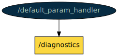

# COLA2_LOG package

This package contains nodes related to the logging/storing cola2 parameters and data.

The `default_param_handler` node requires the python module `ruamel.yaml`. The `cola2_version` node requires the python module  `gitpython`. To install these packages:

```bash
pip install ruamel.yaml gitpython
```

To check whether the PC boots and shutdowns correctly, the shutdown logger startup process can be installed using systemd to start at boot:

```bash
# copy to systemd folder
sudo cp startup_processes/shutdown_logger_startup_process.service /etc/systemd/system/
# reload to have the new service
sudo systemctl --system daemon-reload
# add as start process
sudo systemctl enable shutdown_logger_startup_process
# reboot
sudo reboot
```

[TOC]

[//]: <> (bag_recorder start)

## bag_recorder

**Node**: /bag_recorder

This node provides services to start and stop the launch_bag.launch, which is in charge of recording bag files with a custom configuration.


**Publishers**:

* /diagnostics [[diagnostic_msgs/DiagnosticArray](http://docs.ros.org/noetic/api/diagnostic_msgs/html/msg/DiagnosticArray.html)]

**Subscribers**: None


**Services**:

* /bag_recorder/disable_logs [[std_srvs/Trigger](http://docs.ros.org/noetic/api/std_srvs/html/srv/Trigger.html)]
* /bag_recorder/enable_logs [[std_srvs/Trigger](http://docs.ros.org/noetic/api/std_srvs/html/srv/Trigger.html)]

**Parameters**: None


[//]: <> (bag_recorder end)

[//]: <> (computer_logger start)

## computer_logger

**Node**: /computer_logger

This node publishes CPU/RAM usage data and temperature of the vehicle's computer.


**Publishers**:

* /computer_logger/cpu_usage [[std_msgs/Float32](http://docs.ros.org/noetic/api/std_msgs/html/msg/Float32.html)]
* /computer_logger/ram_usage [[std_msgs/Float32](http://docs.ros.org/noetic/api/std_msgs/html/msg/Float32.html)]
* /computer_logger/temperature [[sensor_msgs/Temperature](http://docs.ros.org/noetic/api/sensor_msgs/html/msg/Temperature.html)]
* /diagnostics [[diagnostic_msgs/DiagnosticArray](http://docs.ros.org/noetic/api/diagnostic_msgs/html/msg/DiagnosticArray.html)]

**Subscribers**: None


**Services**: None


**Parameters**: None


[//]: <> (computer_logger end)

[//]: <> (default_param_handler start)

## default_param_handler

**Node**: /default_param_handler

This node provides services to store current parameters in the rosparam server as defaults by writing them to their corresponding .YAML files.



**Publishers**:

* /diagnostics [[diagnostic_msgs/DiagnosticArray](http://docs.ros.org/noetic/api/diagnostic_msgs/html/msg/DiagnosticArray.html)]

**Subscribers**: None


**Services**:

* /default_param_handler/update_param_in_yaml [[cola2_msgs/String](http://api.iquarobotics.com/202401/api/cola2_msgs/html/srv/String.html)]
* /default_param_handler/update_params_in_yamls [[std_srvs/Trigger](http://docs.ros.org/noetic/api/std_srvs/html/srv/Trigger.html)]

**Parameters**:

* /default_param_handler/config_folder
* /default_param_handler/config_pkg

[//]: <> (default_param_handler end)

[//]: <> (param_logger start)

## param_logger

**Node**: /param_logger

This node publishes all parameters loaded in the rosparam server in a string topic for logging/debugging purposes.


**Publishers**:

* /diagnostics [[diagnostic_msgs/DiagnosticArray](http://docs.ros.org/noetic/api/diagnostic_msgs/html/msg/DiagnosticArray.html)]
* /param_logger/params_string [[std_msgs/String](http://docs.ros.org/noetic/api/std_msgs/html/msg/String.html)]

**Subscribers**: None


**Services**:

* /param_logger/publish_params [[std_srvs/Trigger](http://docs.ros.org/noetic/api/std_srvs/html/srv/Trigger.html)]

**Parameters**: None


[//]: <> (param_logger end)


[//]: <> (cola2_version start)

## cola2_version

**Node**: /cola2_version

This node reports the status of the used IQUA repositories in the current catkin_ws.


**Publishers**:

* /cola2_version/version [[std_msgs/String](http://docs.ros.org/noetic/api/std_msgs/html/msg/String.html)]
* /diagnostics [[diagnostic_msgs/DiagnosticArray](http://docs.ros.org/noetic/api/diagnostic_msgs/html/msg/DiagnosticArray.html)]

**Subscribers**: None


**Services**: None


**Parameters**: None


[//]: <> (cola2_version end)

[//]: <> (mission_reporter start)

## mission_reporter

**Node**: /mission_reporter

This node reports mission success or failure with some statistics for each executed mission.


**Publishers**: None


**Subscribers**:

* /captain/captain_status [[cola2_msgs/CaptainStatus](http://api.iquarobotics.com/202401/api/cola2_msgs/html/msg/CaptainStatus.html)]
* /safety_supervisor/status [[cola2_msgs/SafetySupervisorStatus](http://api.iquarobotics.com/202401/api/cola2_msgs/html/msg/SafetySupervisorStatus.html)]

**Services**:

* /mission_reporter/get_last_report [[std_srvs/Trigger](http://docs.ros.org/noetic/api/std_srvs/html/srv/Trigger.html)]
* /mission_reporter/reset_last_report [[std_srvs/Trigger](http://docs.ros.org/noetic/api/std_srvs/html/srv/Trigger.html)]

**Parameters**:

* /mission_reporter/filter_nodes
* /mission_reporter/reports_folder
* /mission_reporter/rosout_include_nanoseconds
* /mission_reporter/rosout_time_format

[//]: <> (mission_reporter end)