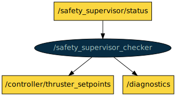

# COLA2 SAFETY

This is a ROS package with nodes to perform safety checks to the COLA2 architecture.

[TOC]

[//]: <> (safe_depth_altitude start)

## safe_depth_altitude

**Node**: /safe_depth_altitude

This node prevents the vehicle to go below a maximum depth or a minimum altitude by sending a BodyVelocityReq asking a negative heave with maximum priority.

**Publishers**:

* /controller/body_velocity_req [[cola2_msgs/BodyVelocityReq](http://api.iquarobotics.com/202401/api/cola2_msgs/html/msg/BodyVelocityReq.html)]
* /diagnostics [[diagnostic_msgs/DiagnosticArray](http://docs.ros.org/noetic/api/diagnostic_msgs/html/msg/DiagnosticArray.html)]

**Subscribers**:

* /navigator/navigation [[cola2_msgs/NavSts](http://api.iquarobotics.com/202401/api/cola2_msgs/html/msg/NavSts.html)]

**Services**:

* /safe_depth_altitude/disable_no_altitude_goes_up [[std_srvs/Trigger](http://docs.ros.org/noetic/api/std_srvs/html/srv/Trigger.html)]
* /safe_depth_altitude/enable_no_altitude_goes_up [[std_srvs/Trigger](http://docs.ros.org/noetic/api/std_srvs/html/srv/Trigger.html)]
* /safe_depth_altitude/reload_params [[std_srvs/Trigger](http://docs.ros.org/noetic/api/std_srvs/html/srv/Trigger.html)]

**Parameters**:

* /safe_depth_altitude/max_depth
* /safe_depth_altitude/min_altitude
* /safe_depth_altitude/min_altitude_starts_at_depth

[//]: <> (safe_depth_altitude end)

[//]: <> (safety_supervisor start)

## safety_supervisor

**Node**: /safety_supervisor

This node checks a set of rules aimed at detecting errors in the system (low battery level, water leak sensors, data gap in a navigation sensor, etc.). If any of the rule checks is triggered, the safety supervisor performs a recovery action, which acts appropriately depending on the type of error.

**Publishers**:

* /controller/thruster_setpoints [[cola2_msgs/Setpoints](http://api.iquarobotics.com/202401/api/cola2_msgs/html/msg/Setpoints.html)]
* /safety_supervisor/rules_recovery_actions [[cola2_msgs/RecoveryAction](http://api.iquarobotics.com/202401/api/cola2_msgs/html/msg/RecoveryAction.html)]
* /safety_supervisor/status [[cola2_msgs/SafetySupervisorStatus](http://api.iquarobotics.com/202401/api/cola2_msgs/html/msg/SafetySupervisorStatus.html)]

**Subscribers**:

* /captain/captain_status [[cola2_msgs/CaptainStatus](http://api.iquarobotics.com/202401/api/cola2_msgs/html/msg/CaptainStatus.html)]
* /captain/state_feedback [[cola2_msgs/CaptainStateFeedback](http://api.iquarobotics.com/202401/api/cola2_msgs/html/msg/CaptainStateFeedback.html)]
* /controller/world_waypoint_req [[cola2_msgs/WorldWaypointReq](http://api.iquarobotics.com/202401/api/cola2_msgs/html/msg/WorldWaypointReq.html)]
* /diagnostics_agg [[diagnostic_msgs/DiagnosticArray](http://docs.ros.org/noetic/api/diagnostic_msgs/html/msg/DiagnosticArray.html)]
* /navigator/navigation [[cola2_msgs/NavSts](http://api.iquarobotics.com/202401/api/cola2_msgs/html/msg/NavSts.html)]

**Services**:

* /safety_supervisor/manual/set_level [[cola2_msgs/Recovery](http://api.iquarobotics.com/202401/api/cola2_msgs/html/srv/Recovery.html)]
* /safety_supervisor/reload_params [[std_srvs/Trigger](http://docs.ros.org/noetic/api/std_srvs/html/srv/Trigger.html)]
* /safety_supervisor/reset_emergency_ramp [[std_srvs/Trigger](http://docs.ros.org/noetic/api/std_srvs/html/srv/Trigger.html)]

**Parameters**:

* /safety_supervisor/batteries/min_charge
* /safety_supervisor/batteries/min_voltage
* /safety_supervisor/batteries/type
* /safety_supervisor/captain/type
* /safety_supervisor/check_enabled_abort_and_surface/diagnostic_status_names_to_check
* /safety_supervisor/check_enabled_abort_and_surface/level_if_not_enabled
* /safety_supervisor/check_enabled_abort_and_surface/type
* /safety_supervisor/check_enabled_emergency_surface/diagnostic_status_names_to_check
* /safety_supervisor/check_enabled_emergency_surface/level_if_not_enabled
* /safety_supervisor/check_enabled_emergency_surface/type
* /safety_supervisor/check_enabled_informative/diagnostic_status_names_to_check
* /safety_supervisor/check_enabled_informative/level_if_not_enabled
* /safety_supervisor/check_enabled_informative/type
* /safety_supervisor/comms/modem_data_timeout
* /safety_supervisor/comms/type
* /safety_supervisor/drop_weight_service
* /safety_supervisor/emergency_surface_setpoints
* /safety_supervisor/manual/type
* /safety_supervisor/navigator/altitude_data_timeout
* /safety_supervisor/navigator/depth_data_timeout
* /safety_supervisor/navigator/dvl_data_timeout
* /safety_supervisor/navigator/gps_data_timeout
* /safety_supervisor/navigator/imu_data_timeout
* /safety_supervisor/navigator/min_frequency
* /safety_supervisor/navigator/nav_data_timeout
* /safety_supervisor/navigator/type
* /safety_supervisor/safety_rule_names
* /safety_supervisor/teleoperation/teleoperation_link_timeout
* /safety_supervisor/teleoperation/type
* /safety_supervisor/temperature_cpu/diagnostic_status_name
* /safety_supervisor/temperature_cpu/max_temperature
* /safety_supervisor/temperature_cpu/type
* /safety_supervisor/temperature_pc_cylinder/diagnostic_status_name
* /safety_supervisor/temperature_pc_cylinder/max_temperature
* /safety_supervisor/temperature_pc_cylinder/type
* /safety_supervisor/virtual_cage/enables_abort_and_surface
* /safety_supervisor/virtual_cage/type
* /safety_supervisor/watchdog_timer/timeout
* /safety_supervisor/watchdog_timer/type
* /safety_supervisor/water_inside/check_battery_housing
* /safety_supervisor/water_inside/check_extra_housing
* /safety_supervisor/water_inside/type

[//]: <> (safety_supervisor end)

[//]: <> (safety_supervisor_checker start)

## safety_supervisor_checker

**Node**: /safety_supervisor_checker

This node continuously checks that the safety_supervisor node is alive. If the safety_supervisor node dies, this node performs an emergency surface recovery action.

**Publishers**:

* /controller/thruster_setpoints [[cola2_msgs/Setpoints](http://api.iquarobotics.com/202401/api/cola2_msgs/html/msg/Setpoints.html)]
* /diagnostics [[diagnostic_msgs/DiagnosticArray](http://docs.ros.org/noetic/api/diagnostic_msgs/html/msg/DiagnosticArray.html)]

**Subscribers**:

* /safety_supervisor/status [[cola2_msgs/SafetySupervisorStatus](http://api.iquarobotics.com/202401/api/cola2_msgs/html/msg/SafetySupervisorStatus.html)]

**Services**: None

**Parameters**: None

[//]: <> (safety_supervisor_checker end)

[//]: <> (virtual_cage start)

## virtual_cage

**Node**: /virtual_cage

This node checks if the vehicle moves beyond some given virtual limits defined in NED coordinates and publishes a diagnostic message.

**Publishers**:

* /diagnostics [[diagnostic_msgs/DiagnosticArray](http://docs.ros.org/noetic/api/diagnostic_msgs/html/msg/DiagnosticArray.html)]
* /virtual_cage/cage_marker [[visualization_msgs/Marker](http://docs.ros.org/noetic/api/visualization_msgs/html/msg/Marker.html)]

**Subscribers**:

* /navigator/navigation [[cola2_msgs/NavSts](http://api.iquarobotics.com/202401/api/cola2_msgs/html/msg/NavSts.html)]

**Services**:

* /virtual_cage/reload_params [[std_srvs/Trigger](http://docs.ros.org/noetic/api/std_srvs/html/srv/Trigger.html)]

**Parameters**:

* /virtual_cage/cage_center_east
* /virtual_cage/cage_center_north
* /virtual_cage/cage_radius

[//]: <> (virtual_cage end)

[//]: <> (watchdog_timer start)

## watchdog_timer

**Node**: /watchdog_timer

This node keeps track of the COLA2 running time. It is used by the safety supervisor to check it against the safety timeout and trigger and abort and surface recovery action.

**Publishers**:

* /diagnostics [[diagnostic_msgs/DiagnosticArray](http://docs.ros.org/noetic/api/diagnostic_msgs/html/msg/DiagnosticArray.html)]
* /watchdog_timer/elapsed_time [[std_msgs/Int32](http://docs.ros.org/noetic/api/std_msgs/html/msg/Int32.html)]

**Subscribers**: None

**Services**:

* /watchdog_timer/reset_timeout [[std_srvs/Trigger](http://docs.ros.org/noetic/api/std_srvs/html/srv/Trigger.html)]

**Parameters**: None

[//]: <> (watchdog_timer end)
