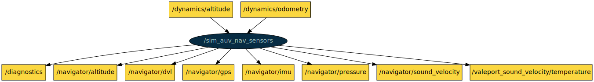

# COLA2 SIM

This is a ROS package with nodes to simulate COLA2-based AUVs and sensors.

[TOC]

[//]: <> (dynamics start)

## dynamics

**Node**: /dynamics

This node takes as inputs the thrusters setpoints and simulates the AUV dynamics. The outputs are the vehicle's pose and velocity.

**Publishers**:

* /diagnostics [[diagnostic_msgs/DiagnosticArray](http://docs.ros.org/noetic/api/diagnostic_msgs/html/msg/DiagnosticArray.html)]
* /dynamics/odometry [[nav_msgs/Odometry](http://docs.ros.org/noetic/api/nav_msgs/html/msg/Odometry.html)]
* /gazebo/set_model_state [[gazebo_msgs/ModelState](http://docs.ros.org/noetic/api/gazebo_msgs/html/msg/ModelState.html)]
* /setpoints_selector/thruster_setpoints [[cola2_msgs/Setpoints](http://api.iquarobotics.com/202401/api/cola2_msgs/html/msg/Setpoints.html)]

**Subscribers**:

* /controller/merged_body_force_req [[cola2_msgs/BodyForceReq](http://api.iquarobotics.com/202401/api/cola2_msgs/html/msg/BodyForceReq.html)]
* /controller/thruster_setpoints [[cola2_msgs/Setpoints](http://api.iquarobotics.com/202401/api/cola2_msgs/html/msg/Setpoints.html)]
* /dynamics/current [[geometry_msgs/Vector3Stamped](http://docs.ros.org/noetic/api/geometry_msgs/html/msg/Vector3Stamped.html)]
* /dynamics/pose_overwrite [[nav_msgs/Odometry](http://docs.ros.org/noetic/api/nav_msgs/html/msg/Odometry.html)]

**Services**:

* /dynamics/reload_params [[std_srvs/Trigger](http://docs.ros.org/noetic/api/std_srvs/html/srv/Trigger.html)]

**Parameters**:

* /dynamics/a_fins
* /dynamics/buoyancy
* /dynamics/buoyancy_center
* /dynamics/damping
* /dynamics/density
* /dynamics/fins_topic
* /dynamics/initial_pose
* /dynamics/initial_velocity
* /dynamics/k_cd_fins
* /dynamics/k_cl_fins
* /dynamics/mass
* /dynamics/max_fins_angle
* /dynamics/number_of_thrusters
* /dynamics/period
* /dynamics/quadratic_damping
* /dynamics/radius
* /dynamics/tensor
* /dynamics/thruster_1_max_force_negative
* /dynamics/thruster_1_max_force_positive
* /dynamics/thruster_1_poly_negative
* /dynamics/thruster_1_poly_positive
* /dynamics/thruster_2_max_force_negative
* /dynamics/thruster_2_max_force_positive
* /dynamics/thruster_2_poly_negative
* /dynamics/thruster_2_poly_positive
* /dynamics/thruster_3_max_force_negative
* /dynamics/thruster_3_max_force_positive
* /dynamics/thruster_3_poly_negative
* /dynamics/thruster_3_poly_positive
* /dynamics/thrusters_limiter
* /dynamics/thrusters_matrix
* /dynamics/thrusters_max_step
* /dynamics/thrusters_symmetric
* /dynamics/thrusters_tau
* /dynamics/use_force_topic
* /dynamics/world_frame_id

[//]: <> (dynamics end)

[//]: <> (sim_auv_nav_sensors start)

## sim_auv_nav_sensors

**Node**: /sim_auv_nav_sensors

This node simulates the navigation sensors of an AUV using the output of the dynamics node.

**Publishers**:

* /diagnostics [[diagnostic_msgs/DiagnosticArray](http://docs.ros.org/noetic/api/diagnostic_msgs/html/msg/DiagnosticArray.html)]
* /navigator/altitude [[sensor_msgs/Range](http://docs.ros.org/noetic/api/sensor_msgs/html/msg/Range.html)]
* /navigator/dvl [[cola2_msgs/DVL](http://api.iquarobotics.com/202401/api/cola2_msgs/html/msg/DVL.html)]
* /navigator/gps [[sensor_msgs/NavSatFix](http://docs.ros.org/noetic/api/sensor_msgs/html/msg/NavSatFix.html)]
* /navigator/imu [[sensor_msgs/Imu](http://docs.ros.org/noetic/api/sensor_msgs/html/msg/Imu.html)]
* /navigator/pressure [[sensor_msgs/FluidPressure](http://docs.ros.org/noetic/api/sensor_msgs/html/msg/FluidPressure.html)]
* /navigator/sound_velocity [[cola2_msgs/Float32Stamped](http://api.iquarobotics.com/202401/api/cola2_msgs/html/msg/Float32Stamped.html)]
* /valeport_sound_velocity/temperature [[sensor_msgs/Temperature](http://docs.ros.org/noetic/api/sensor_msgs/html/msg/Temperature.html)]

**Subscribers**:

* /dynamics/altitude [[sensor_msgs/Range](http://docs.ros.org/noetic/api/sensor_msgs/html/msg/Range.html)]
* /dynamics/odometry [[nav_msgs/Odometry](http://docs.ros.org/noetic/api/nav_msgs/html/msg/Odometry.html)]

**Services**: None

**Parameters**:

* /sim_auv_nav_sensors/depth_period
* /sim_auv_nav_sensors/depth_pressure_covariance
* /sim_auv_nav_sensors/dvl_period
* /sim_auv_nav_sensors/dvl_velocity_covariance
* /sim_auv_nav_sensors/gps_period
* /sim_auv_nav_sensors/gps_position_covariance
* /sim_auv_nav_sensors/imu_orientation_covariance
* /sim_auv_nav_sensors/imu_period
* /sim_auv_nav_sensors/output_depth_pressure_covariance
* /sim_auv_nav_sensors/output_dvl_velocity_covariance
* /sim_auv_nav_sensors/output_gps_position_covariance
* /sim_auv_nav_sensors/output_imu_orientation_covariance
* /sim_auv_nav_sensors/output_usbl_position_covariance
* /sim_auv_nav_sensors/sea_bottom_depth
* /sim_auv_nav_sensors/sound_speed
* /sim_auv_nav_sensors/usbl_depth_start
* /sim_auv_nav_sensors/usbl_period
* /sim_auv_nav_sensors/usbl_position_covariance

[//]: <> (sim_auv_nav_sensors end)

[//]: <> (sim_internal_sensors start)

## sim_internal_sensors

**Node**: /sim_internal_sensors

This node simulates the batteries (e.g. decaying battery charge) and different diagnostics from internal sensors (water sensors, temperature, etc).

**Publishers**:

* /batteries/status [[sensor_msgs/BatteryState](http://docs.ros.org/noetic/api/sensor_msgs/html/msg/BatteryState.html)]
* /batteries_cylinder/humidity [[sensor_msgs/RelativeHumidity](http://docs.ros.org/noetic/api/sensor_msgs/html/msg/RelativeHumidity.html)]
* /batteries_cylinder/pressure [[sensor_msgs/FluidPressure](http://docs.ros.org/noetic/api/sensor_msgs/html/msg/FluidPressure.html)]
* /batteries_cylinder/temperature [[sensor_msgs/Temperature](http://docs.ros.org/noetic/api/sensor_msgs/html/msg/Temperature.html)]
* /batteries_cylinder/water_detected [[std_msgs/Bool](http://docs.ros.org/noetic/api/std_msgs/html/msg/Bool.html)]
* /diagnostics [[diagnostic_msgs/DiagnosticArray](http://docs.ros.org/noetic/api/diagnostic_msgs/html/msg/DiagnosticArray.html)]
* /pc_cylinder/humidity [[sensor_msgs/RelativeHumidity](http://docs.ros.org/noetic/api/sensor_msgs/html/msg/RelativeHumidity.html)]
* /pc_cylinder/pressure [[sensor_msgs/FluidPressure](http://docs.ros.org/noetic/api/sensor_msgs/html/msg/FluidPressure.html)]
* /pc_cylinder/temperature [[sensor_msgs/Temperature](http://docs.ros.org/noetic/api/sensor_msgs/html/msg/Temperature.html)]
* /pc_cylinder/water_detected [[std_msgs/Bool](http://docs.ros.org/noetic/api/std_msgs/html/msg/Bool.html)]

**Subscribers**: None

**Services**: None

**Parameters**:

* /sim_internal_sensors/battery_consumption_per_second
* /sim_internal_sensors/initial_battery_level

[//]: <> (sim_internal_sensors end)
